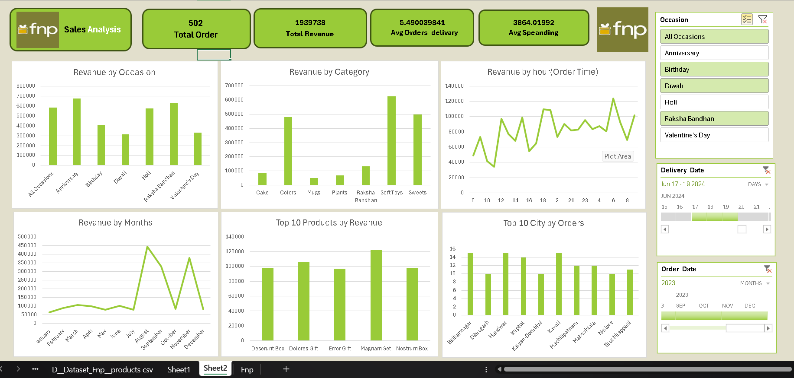

# Ferns-and-Petals-FNP-Sales-Analysis-

  

Detailed Project Summary
📈 Project Objective:
To analyze the sales data of Ferns and Petals (FNP) using Excel and create an interactive dashboard. The goal is to uncover trends in customer behavior, product performance, sales timing, and seasonal impacts to help improve business strategies.

📊 Key Metrics and Findings:
Total Orders:

1,000 orders were placed during the analysis period.

Total Revenue:

₹35,20,984 revenue was generated.

Average Order-Delivery Time:

5.53 days on average for an order to be delivered after placement.

Average Customer Spend:

₹3,520.98 per customer on average.

🛍️ Revenue Insights:
Revenue by Occasion:

Top Occasions:

Anniversary and Raksha Bandhan were the highest revenue-generating occasions, followed closely by Holi.

Lower Revenue Occasions:

Diwali and Valentine's Day generated relatively lower revenue compared to other events.

Revenue by Category:

Top Categories:

Colors, Soft Toys, and Sweets were the best-performing product categories.

Underperforming Categories:

Mugs and Plants generated comparatively less revenue.

Revenue by Hour (Order Time):

Peak Hours:

Orders and revenue were highest between 4 PM and 8 PM, suggesting that customers preferred placing orders in the evening.

Revenue by Months:

Best Months:

March and August saw the highest revenue spikes, likely due to festivals or seasonal demand.

Low-Performing Months:

May, June, and July had lower revenues, indicating off-peak seasons.

🏆 Product and City Insights:
Top 5 Products by Revenue:

Deserunt Box, Dolores Gift, Harum Pack, Magnam Set, and Quia Gift were the highest revenue-generating products.

Top 10 Cities by Number of Orders:

Major cities with the most orders include Dibrugarh, Imphal, Kavali, Bhatpara, and Bilaspur.

These cities showed strong demand, suggesting key target markets for future campaigns.

🛠️ Tools and Techniques Used:
Excel Functions:

Pivot Tables, Pivot Charts, Slicers, Data Validation

Visualization Techniques:

Line charts, Bar graphs, and Column charts for trend analysis

Dynamic Filters:

Implemented Slicers for filtering by Order Date, Delivery Date, and Occasion.

📌 Business Insights & Recommendations:
Focus Marketing on Peak Seasons:

Invest more in marketing during March, August, and around high-revenue occasions like Raksha Bandhan and Anniversaries.

Optimize Delivery:

Explore ways to reduce delivery times, especially around peak seasons.

Promote Popular Categories:

Focus more on promoting Colors, Soft Toys, and Sweets as they have high revenue potential.

Target High-Performing Cities:

Launch targeted offers or loyalty programs in cities like Dibrugarh and Imphal to maximize order volumes.

✨ Conclusion:
This Excel-based dashboard efficiently captures key sales insights for Ferns and Petals. It empowers decision-makers to track revenue performance, identify strong products and seasons, and strategically optimize sales and marketing efforts based on customer behavior and demand patterns.

